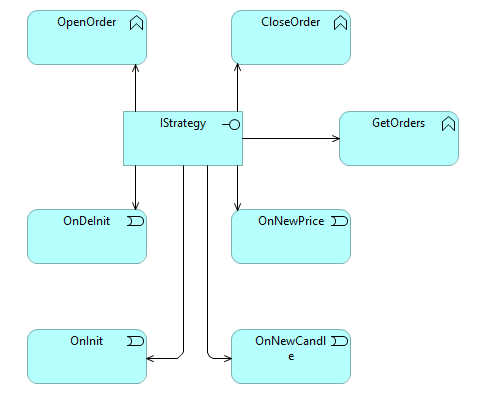
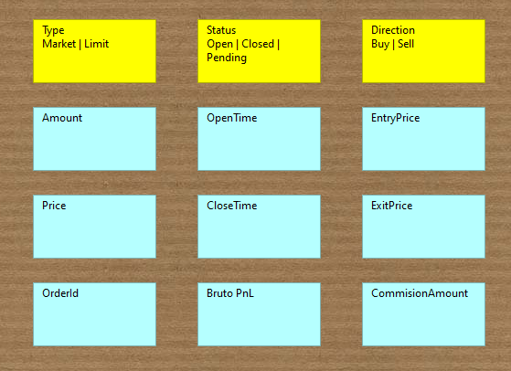

# IStrategy
this interface is the main way to connect and use the Engine.
its functionality is to open/close and monitor orders.
it will also(in the future have the functionality to connect to the wallet)
its in a different project for modularity.

## Order
the order type is the data object that keeps all the data needed to interact with the engine.
